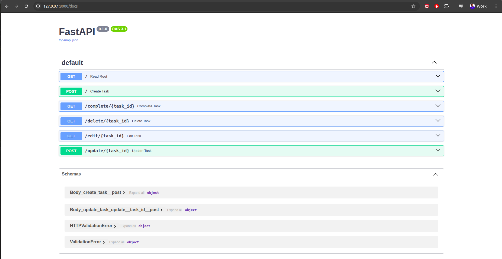
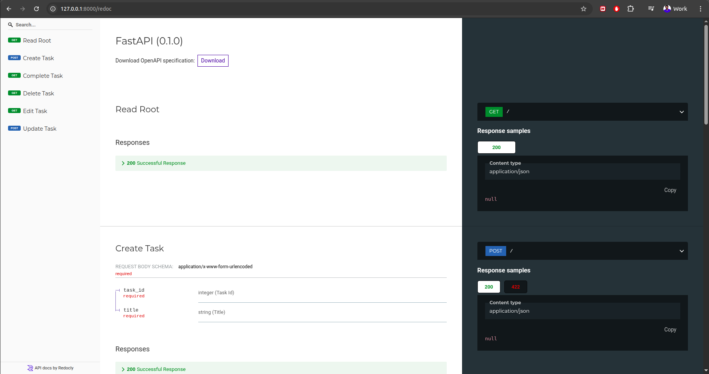
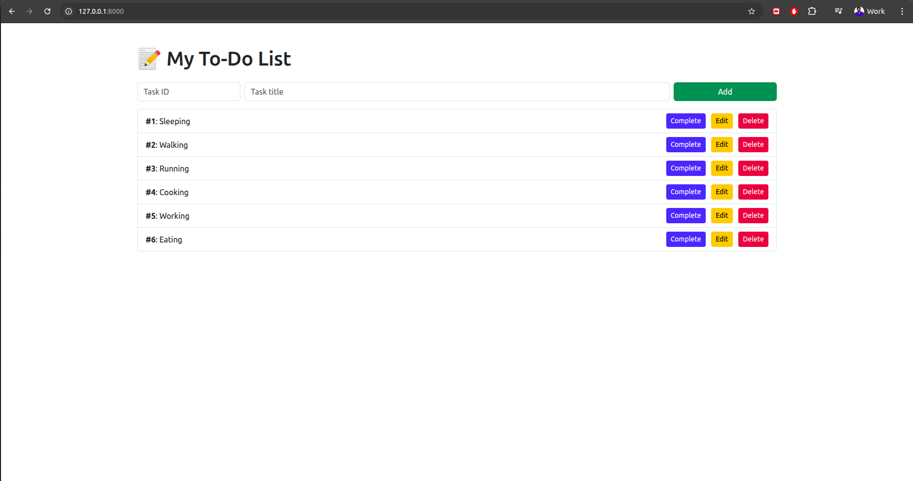

# 📝 FastAPI To-Do List App

A simple and clean web-based To-Do List application built with **FastAPI**, **SQLModel**, **Jinja2 Templates**, and **SQLite**.

## 🚀 Features

- ✅ Add tasks with custom `task_id` and title
- ✏️ Edit task title and completion status
- ✅ Mark tasks as completed
- ❌ Delete tasks
- 📄 Clean Bootstrap-powered HTML UI
- 🗂 Persistent data using SQLite
- 🌐 Fully backend-rendered Web UI using FastAPI + Jinja2

# 🧠 Why FastAPI?

We chose FastAPI because it's:

⚡ Blazingly fast — built on top of Starlette & Pydantic

⛳ Easy to use — simple decorators, auto request validation

📦 Built-in async support — scales well for modern web backends

📄 Automatic interactive API docs — powered by Swagger UI

🔒 Modern standards — follows OpenAPI, JSON Schema, OAuth2

FastAPI is ideal for projects where performance, developer productivity, and clean code are paramount.

🔍 API Docs with Swagger UI
FastAPI provides an auto-generated, interactive Swagger UI to test your API endpoints. It’s available at:

http://127.0.0.1:8000/docs

You also get ReDoc (alternative view):

http://127.0.0.1:8000/redoc

# With Swagger, you can:

✅Try out endpoints directly in your browser

✅See available routes, input/output schemas

✅Debug API without writing a single line of frontend

✅This makes API testing fast and visual — no need for Postman or CURL.




---

## 📁 Project Structure

```bash
fastapi_todo_app/
├── main.py # Main FastAPI app
├── database.py # DB setup and session config
├── schemas.py # Task model using SQLModel
├── requirements.txt # Project dependencies
└── templates/ # HTML templates (Jinja2)
├── index.html # Home page for listing/adding tasks
└── edit.html # Edit task form
```

## ⚙️ Installation

### 1. Clone the repository

```bash
git clone https://github.com/KUMAR-REDDY-BAVANASI/fastapi-todo-application.git
cd fastapi-todo-application
```

2. Create a virtual environment (optional but recommended)

```bash
python3 -m venv venv      # On macOS/Linux
source venv/bin/activate  # On macOS/Linux

python -m venv venv    # On Windows
venv\Scripts\activate  # On Windows
```

3. Install dependencies

```bash
pip3 install -r requirements.txt   # On macOS/Linux
```

```bash
pip install -r requirements.txt    # On Windows
```

# ▶️ Running the App

```bash
uvicorn main:app --reload
```

Visit the app in your browser at: 👉 http://127.0.0.1:8000



# 🧪 Features Overview

Add task with ID + title

Edit task with check/uncheck "completed"

Click to mark task as done

Delete individual task

All data saved in database.db

# 📦 Requirements

Python 3.8+

FastAPI

SQLModel

Jinja2

Uvicorn

python-multipart

# 📚 Learnings

How to use FastAPI for full-stack web development

Using Jinja2 templates for dynamic web UI

Handling form submissions in FastAPI

Building REST endpoints

SQLite database interaction via SQLModel


# 🐳 Run with Docker (Optional)
# You can containerize the FastAPI To-Do app using Docker or Docker Compose.

```bash
# 1. Build the Docker image
docker build -t fastapi-todo-app .

# 2. Run the container
docker run -d -p 8000:8000 fastapi-todo-app
```

👉 App will be accessible at: http://localhost:8001

To stop and remove the container:

```bash
docker ps                # Get the container ID
docker stop <container_id>
docker rm <container_id>
```

📦 Run using Docker Compose (Optional)
You can also use Docker Compose to simplify the process:

```bash
# 1. Build and start the app
docker-compose up --build

# 2. Stop the app
docker-compose down
```

👉 App will be available at: http://localhost:8002

# 📦 Docker Image Overview

* Base Image: python:3.10-slim
* Exposed Port: 8000
* Startup CMD: uvicorn main:app --host 0.0.0.0 --port 8000 --reload

